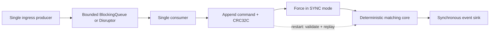

# Architecture and contracts

## Responsibilities and dependency direction

| Layer                | Responsibility                                                                          | Internal dependencies                          |
|----------------------|-----------------------------------------------------------------------------------------|------------------------------------------------|
| `matching`           | `OrderBook` aggregate, order rules, command/event vocabulary and immutable observations | Matching types only                            |
| `application`        | `ExchangeService` write-before-match, `RecoveryService` replay and resource ownership   | Matching and application-owned ports           |
| `infrastructure`     | `FileCommandJournal`, queue and Disruptor adapters                                      | Application ports and matching data types      |
| `bootstrap`          | `ExchangeApplication`, `ExchangeFactory`, `ProcessorFactory`                            | Wires the concrete implementation graph        |
| Benchmark source set | Workloads, measurement, validation, reports and child-process orchestration             | Application/domain/adapters; never the reverse |

The ports are `CommandJournal`, `EventPublisher`, `CommandProcessor` and their journal/processor factory interfaces.
Configured `ExchangeFactory` and `ProcessorFactory` instances create resources through these contracts. The order book's
`EventSink` belongs to the domain; the application publisher extends that callback contract. Application services never
choose files or queue implementations. `ProcessorFactory` contains the only transport-selection switch; the two concrete
processors have their own fields and lifecycle mechanics, with shared ownership/backpressure policy in a package-private
base class.

`RecoveryService` takes ownership of a journal, builds a new book using a discard sink, and returns a live service. On
startup failure it closes the journal and preserves any cleanup exception. `ExchangeService` appends before entering the
domain, making the ordering contract independently testable with an in-memory failing journal. No recovery flag or
mutable sink is stored in the domain.

Mutable orders and level links are private parts of the `OrderBook` aggregate, not public anemic entities. Its only
observations are immutable `BookSnapshot` and `RestingOrder` values. `PriceLevel` owns list mutation, while its nested
resting node owns remaining quantity and validates fills. The sealed command family distinguishes limit, market and
cancel requests; limit/market types supply crossing and remainder rules. `MalformedCommand` preserves structurally
invalid legacy journal records for deterministic rejection. Primitive event callbacks avoid allocating an event object
per callback.

`JournalRecordCodec` owns frame encoding, decoding and checksum state; `FileCommandJournal` owns file lifecycle and
durability. BenchmarkRunner coordinates injected workload, measurement and reporting collaborators. PipelineBenchmark
receives transport and target factories, while CsvReporter writes to an injected destination.

Static remains appropriate for JVM entry points, constants, pure configuration parsing and named immutable command
factories. A static nested resting node has no implicit enclosing instance; it still has private per-object state and
instance behaviour. Records and nested helper types do not introduce global mutable state.

The refactor changes Java package/API names but preserves command semantics and journal v1 bytes. A fixture generated by
the original committed writer is checked into test resources; compatibility tests verify exact encoding, recovery and
continuation. ArchUnit enforces the inward production dependency rules. Benchmark classes compile into
`target/test-classes` only under `-Pbenchmarks` and never enter the application JAR.

## Runtime flow

## State ownership and data structures

`OrderBook` owns bid/ask `TreeMap` price indexes and a `HashMap` from ID to resting order. Each price level has an
intrusive doubly linked FIFO list. This makes cancellation lookup/unlink expected O (1); deleting the final order at a
price additionally costs O (log P), where P is the number of levels. Insertion costs O (log P). Each matching step reads
the best tree entry, O (log P), then accesses the head directly. Matching is proportional to maker orders visited, not
total book depth. No aggregate level quantity is stored, avoiding overflow when individual quantities are valid longs.

An alternative single list is simpler but requires scanning the book for the best price and cancellations. The
independently implemented test oracle uses list scans and sorting. A dense tick array or primitive map might be faster;
the current tree supports the full positive long price range without a large fixed price grid. Boxed keys, nodes,
commands and pipeline submissions still allocate. Optimise these only with a representative workload and allocation
measurements.

The core is deliberately not thread-safe. Its owner must serialize all calls, including snapshots. Pipeline completion
uses a volatile counter to publish all prior handler writes back to the producer. The producer must drain and stop
before transferring ownership. Multiple producers require a separate sequencer; a single-producer Disruptor is not safe
for direct multi-producer use.

## Bounded ingress and failure

Both pipelines have identical handler semantics. A queue takes immutable submissions; Disruptor uses preallocated slots
holding the same submissions. A ring slot remains occupied until processing finishes; a queue slot is freed when taken.
The configured capacity is consequently the same storage capacity, not precisely the same maximum number in flight.

`submit` returns when publication succeeds, **not** when the order has matched or become durable. A full pipeline waits
with short parks until capacity, timeout, interruption or consumer failure. Publication timeout means that particular
submission was not published. Successfully published commands are processed in FIFO order unless the consumer fails; use
`awaitDrained`/`close` to verify completion. A drain timeout does not cancel previously published work. On a handler
failure the queue stops, or the Disruptor skips remaining slots; both report failure. No caller should treat enqueueing
as a trading acknowledgement.

`close` drains, halts and joins with bounded waits. If a user callback never returns, shutdown reports failure after its
deadline; the daemon consumer may remain alive. Such a callback violates the contract, and the process must be treated
as failed. Do not close the journal concurrently with a still-running callback.

## Journal v1

All integers use big-endian byte order. Explicit wire codes are independent of Java enum ordinals.

| Field            | Bytes | Meaning                             |
|------------------|------:|-------------------------------------|
| Header magic     |     4 | `0x4d415443` (`MATC`)               |
| Header version   |     4 | `1`                                 |
| Command sequence |     8 | Contiguous from 1                   |
| Command type     |     4 | 0 null, 1 limit, 2 market, 3 cancel |
| Order ID         |     8 | Signed long, checked by matcher     |
| Side             |     4 | 0 null, 1 buy, 2 sell               |
| Price            |     8 | Tick price                          |
| Quantity         |     8 | Lots                                |
| CRC32C           |     4 | First 40 bytes of this frame        |

The header is 8 bytes; each command is a fixed 44-byte frame. Invalid business commands are logged too, ensuring their
sequence and rejection are reproducible. A null command has the canonical all-zero command fields. CRC detects
accidental damage, not malicious modification.

An exclusive `FileLock` prevents concurrent local writers. The file adapter must complete exactly one successful replay
before append. Failed replay or append poisons the adapter. `RecoveryService` closes the journal on startup failure and
preserves cleanup failures as suppressed exceptions. Recovery checks the header, full-frame CRCs, wire codes and
sequence continuity. A partial final frame is truncated and forced before appending. Any complete bad frame, sequence
gap or unknown version fails closed without truncating it. An empty new file is initialized; a partial header fails. The
v1 reader does not guess how to migrate a future version. Full-record suffix loss cannot be detected without an external
committed-length/replication record.

`RecoveryService` rebuilds a fresh `OrderBook` with `EventSink.DISCARD`, then creates `ExchangeService` with the live
`EventPublisher`. There is no mutable suppression flag. The `CommandJournal` port replays commands to a callback;
`FileCommandJournal` knows nothing about the order-book implementation and can be used with a collecting callback for
forensic comparisons. Startup cost and retained journal size are linear in historical commands. There is no compaction
or snapshot format yet.

## Durability boundary

`SYNC` appends and calls `FileChannel.force(true)` **before** applying and emitting events. A journal failure prevents
matching that command and poisons the exchange. A matching/callback failure also poisons it because in-memory state may
be partially applied; reopening replays the durable command from scratch. A crash after append but before output may
therefore leave a committed command whose response was never received. The monotonically increasing order IDs prevent
repeating an accepted new order; this is not a general exactly-once client response protocol.

`OS_BUFFERED` writes each frame but forces only on close. It is useful for measuring the cost of writes separately from
forced storage. It can lose the OS-buffered tail on machine/power failure and must not be advertised as durable
acknowledgement. `none` in the benchmark bypasses the journal entirely.

File forcing provides the JVM/filesystem contract, not a proof against every controller, filesystem or power failure.
Parent-directory fsync is not implemented; pre-provision the journal before relying on recovery across power loss of a
newly created path. The subprocess crash test demonstrates abrupt process recovery, not power-cut durability. Trading
output is not journalled separately, and there is no replayable outbound feed or replication. A real venue would also
need authenticated ownership for cancellation, risk controls, limits, monitoring, durable feed delivery and operational
recovery drills.

## References

The pipeline comparison uses the real [LMAX Disruptor](https://lmax-exchange.github.io/disruptor/user-guide/). The
single-owner deterministic model follows the principles described
in [The LMAX Architecture](https://martinfowler.com/articles/lmax.html); this repository is an independent small
implementation, not LMAX production code.
